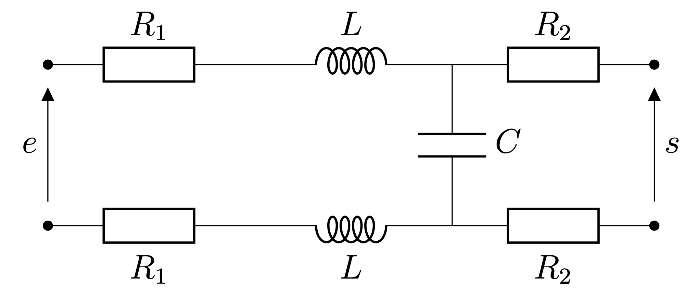

Le schéma électrique du filtre ADSL est semblable à celui représenté ci-dessous.
Ce filtre est conçu pour être connecté à un téléphone fixe dont l'impédance d'entrée est de 600 Ω.

2. Expliquer pourquoi le montage précédent ne permet pas de déterminer la réponse du filtre en situation réelle.

3. Proposer et mettre en œuvre un protocole expérimental permettant de caractériser la réponse du filtre quand il est utilisé en situation réelle.